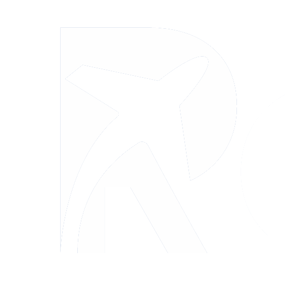

# Restal



Restal is a modern web application built with [Next.js](https://nextjs.org), designed to provide seamless user experiences with a focus on performance and scalability.

---

## 🌐 Preview


The screenshot above showcases the main page interface.

---

## 🛠️ Getting Started

### Prerequisites

Ensure you have the following installed:
- [Node.js](https://nodejs.org/) (v16 or higher)
- [npm](https://www.npmjs.com/) or [yarn](https://yarnpkg.com/)

### Environment Setup

1. Copy `.env.example` to `.env.local`:
   ```bash
   cp .env.example .env.local
   ```

2. Update the environment variables in `.env.local`:
   - `MONGODB_URI`: Your MongoDB connection string
   - `NEXTAUTH_SECRET`: A secret key for session encryption
   - `NEXTAUTH_URL`: Your application URL (e.g., `http://localhost:3000` for development)

### Development Server

Run the development server:

```bash
npm run dev
# or
yarn dev
```

Open [http://localhost:3000](http://localhost:3000) to view the app.

---

## 📂 Project Structure

```
restal/
├── app/                # Application pages and API routes
├── components/         # Reusable UI components
├── config/             # Configuration files
├── contexts/           # React context providers
├── data/               # Static data files
├── hooks/              # Custom React hooks
├── lib/                # Utility libraries
├── models/             # Database models
├── public/             # Static assets (images, etc.)
├── types/              # TypeScript types
```

---

## 📦 Deployment

Deploy your application using [Vercel](https://vercel.com):

1. Push your code to a Git repository.
2. Connect the repository to Vercel.
3. Configure environment variables in the Vercel dashboard.
4. Deploy and enjoy!

---

## 🤝 Contributing

Contributions are welcome! Feel free to open issues or submit pull requests.

---

## 📧 Contact

For inquiries, please contact [Nikita Bryndak](mailto:nikita.bryndak@example.com).
